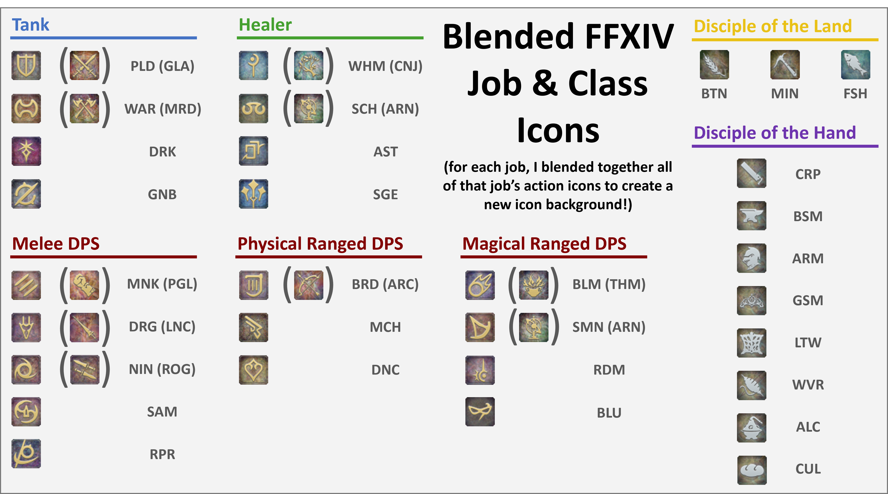

# ffxiv-blended-job-icons
All action icons for each class/job are blended together to create new backgrounds for each job/class icon!

I used python to connect to [xivapi](https://xivapi.com/) to download all class and job icons as well as all the action icons for each job or class. From there, I used the python [pillow](https://pillow.readthedocs.io/en/stable/) library to blend each job's respective actions together.

These blended backgrounds are in `icons_blended_hd/actions_only` (low res versions exist in `icons_blended/actions_only`).

I also overlayed each class or job's icon ontop of the blended background. These can be found at `icons_blended_hd/actions_only_w_overlay`.

You can also just download all of these images by downloading the zip file, `icons_blended.zip` (low resolution) or `icons_blended_hd` (high resolution).

### More Details
- Blended icons do not include role actions, traits, or deprecated actions/traits
- Blends are done by taking the average RGB values at each pixel across all actions
- If a job has a parent class (e.g. WHM/CNJ), both the job's and parent class's actions are all used for the final blended icon.

### Future Work
- Would be cool to blend action icons weighted by frequency of use (could get this data from FFLogs, perhaps)
